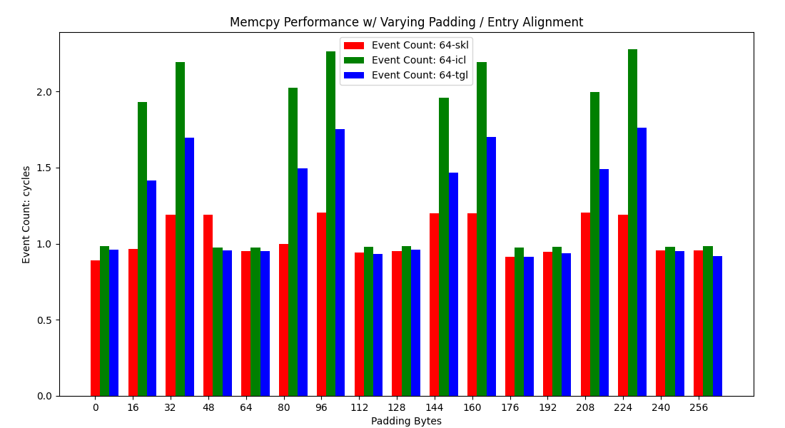
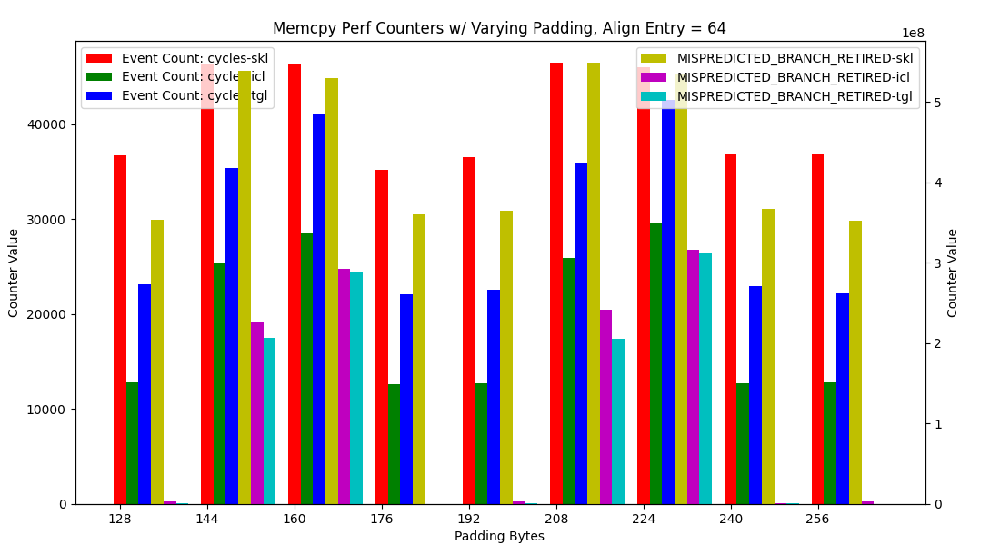
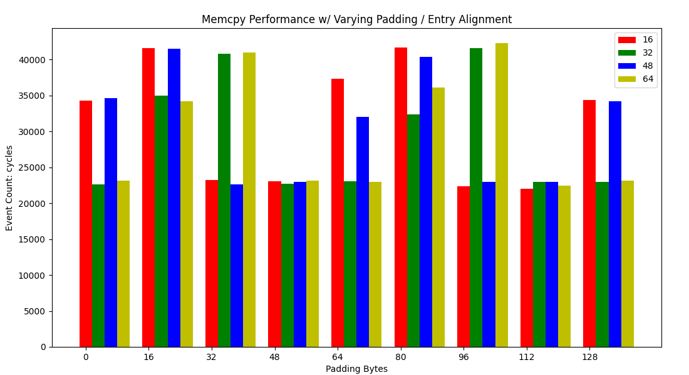
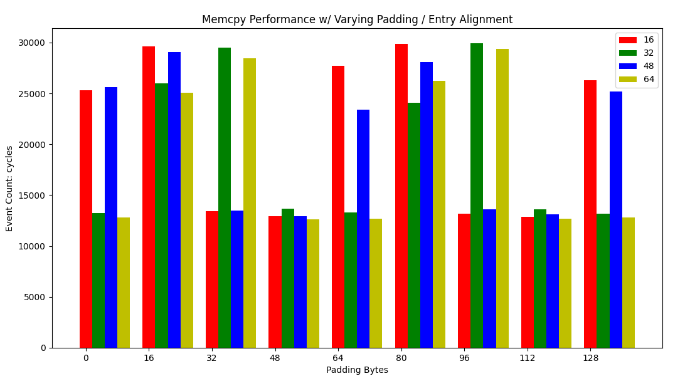
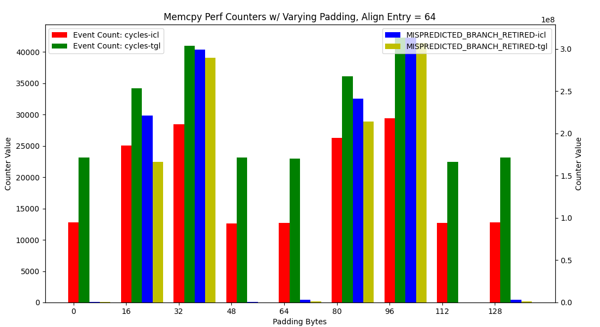
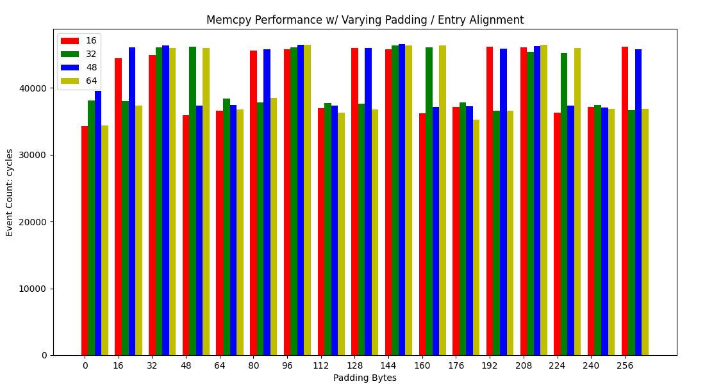
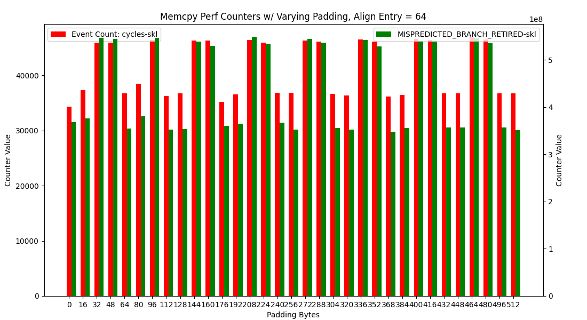
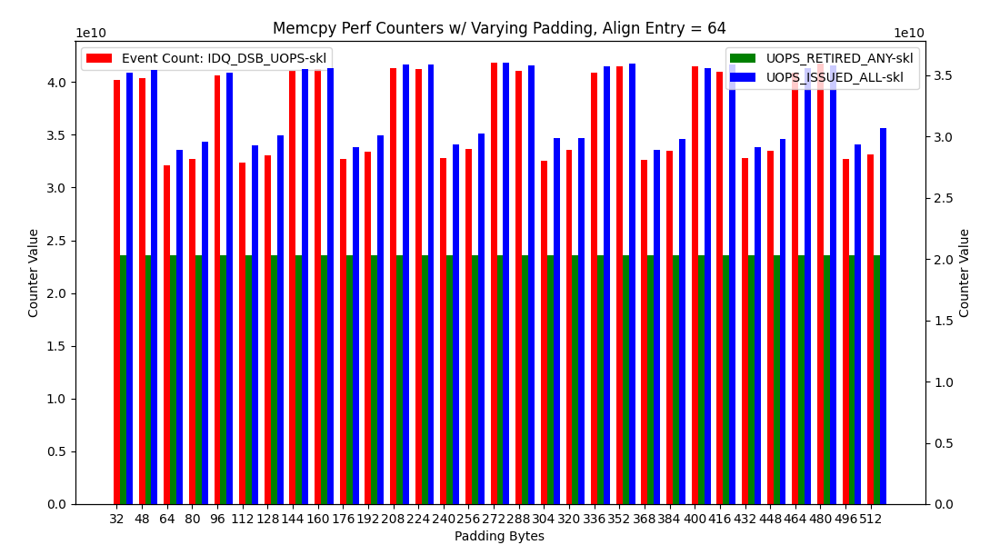

#### BPU Affect on Tigerlake, Icelake, and Skylake

- See testing conditions described in previous writeup
- [Tigerlake CPU](https://ark.intel.com/content/www/us/en/ark/products/208921/intel-core-i7-1165g7-processor-12m-cache-up-to-4-70-ghz-with-ipu.html)
- [Icelake CPU](https://ark.intel.com/content/www/us/en/ark/products/196597/intel-core-i7-1065g7-processor-8m-cache-up-to-3-90-ghz.html)
- [Skylake CPU](https://ark.intel.com/content/www/us/en/ark/products/149091/intel-core-i7-8565u-processor-8m-cache-up-to-4-60-ghz.html)

#### Comparison All Three

We can essentially see the exact same repeated trend for all three processors here:

**Results for `sz` in `[0, 32]` implementation on Skylake, Icelake, and Tigerlake:**

The above values are normalized to median of all runs on the processor and we can see that while Skylake appears to be affected by the same pattern, it is by far affected the least.

All three essentially follow the same conditions for "slow" vs "fast" mode:

The `ALIGN_ENTRY` and `address_of(L(less_vec)) % 64` are as follows:

|ALIGN_ENTRY|0       |16      |32      |48      |
|-----------|--------|--------|--------|--------|
|0          |SLOWER  |SLOWEST |FAST    |FAST    |
|16         |SLOWER  |SLOWEST |FAST    |FAST    |
|32         |FAST    |FAST    |SLOWER  |SLOWEST |
|48         |FAST    |FAST    |SLOWER  |SLOWEST |

Which again boils down to the following formula: `32 & (address_of(L(less_vec)) - address_of(memcpy))`

Although note a distinction in Skylake from Icelake and Tigerlake is that **Skylake does not have a clear distinction between Slower and Slowest mode**.

As well while it appears **branch misses are the root cause on all three CPUs**, though **on Skylake the pattern is significant different**. 

As you can see the results on Skylake are much less binary. **On skylake the change in branch-misses is within a factor of 2**. Whereas **On Tigerlake and Icelake the change in branch-misses is factor of 10^4**.

#### Tigerlake & Icelake

**Observed nearly identical pattern of performance vs `ALIGN_ENTRY` and `PADDING % 64` on *Tigerlake* and *Icelake*.

**Results for `sz` in `[0, 32]` implementation on Tigerlake:**

**Results for `sz` in `[0, 32]` implementation on Icelake:**

Final **the reason for the variance on both Tigerlake and Icelake appears to be branch misses**:

Note: Icelake appears to experience a proportionately more significant slowdown and greater increase in branch misses:

#### Skylake

The Skylake versions appear to suffer from the same issue although to a signficantly reduced magnitude:

**Results for `sz` in `[0, 32]` implementation on Skylake:**

Note that Skylake appears to have two different trend, one with NOP padding in range `[0, 96]` and another with NOP padding in range `[112, ...]`. The reason for this is that in the `[0, 96]` range the `jb L(less_vec)` can use the 2-byte encoding. After `NOP padding == 112`. This end up adding an additional `16 bytes` to the padding.

And again it appears for **Skylake to be related to branch misses**:

Although again the change in branch misses from "slow" to "fast" mode is not nearly as severe as on Icelake or Tigerlake.

And I think we can rule out to Uop Cache as `IDQ_DSB_UOPS` seems to scale 1-1 with `UOPS_ISSUED_ANY` which is indicative of repeated uops due to branch misses.

