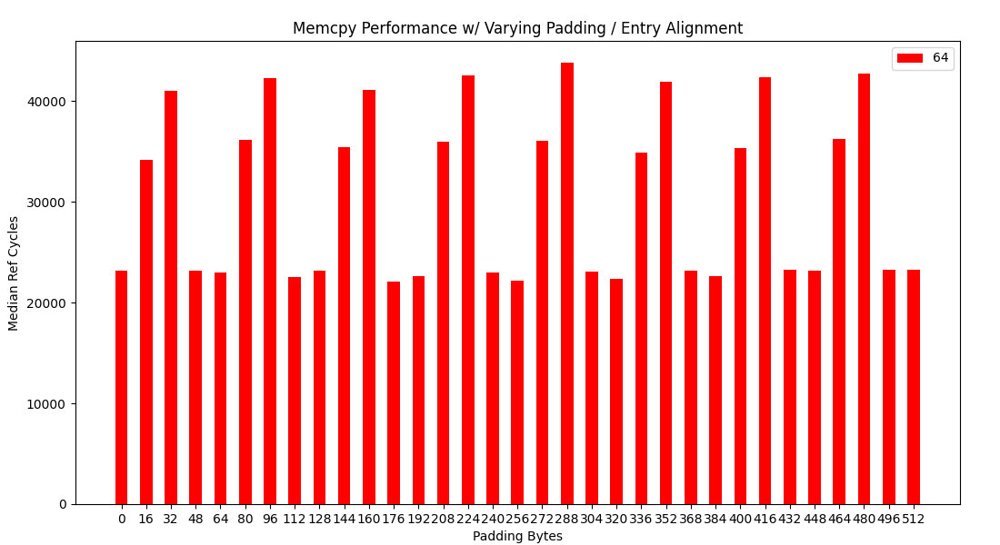
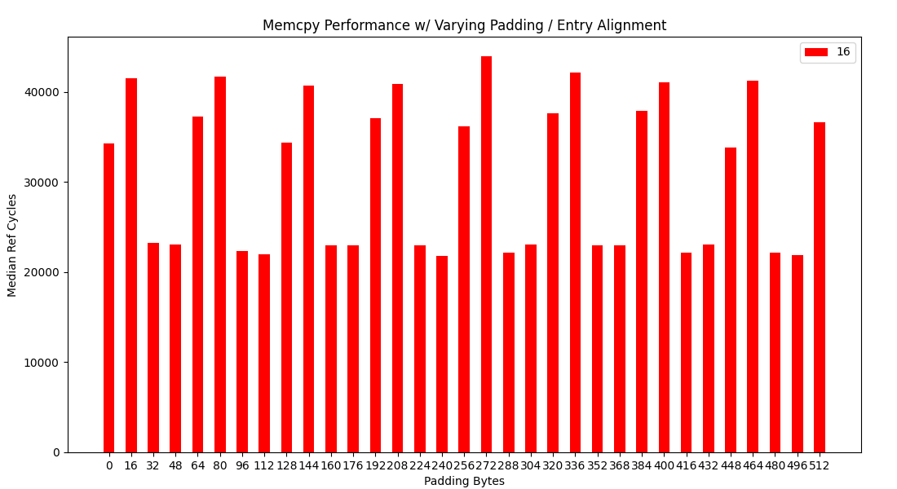
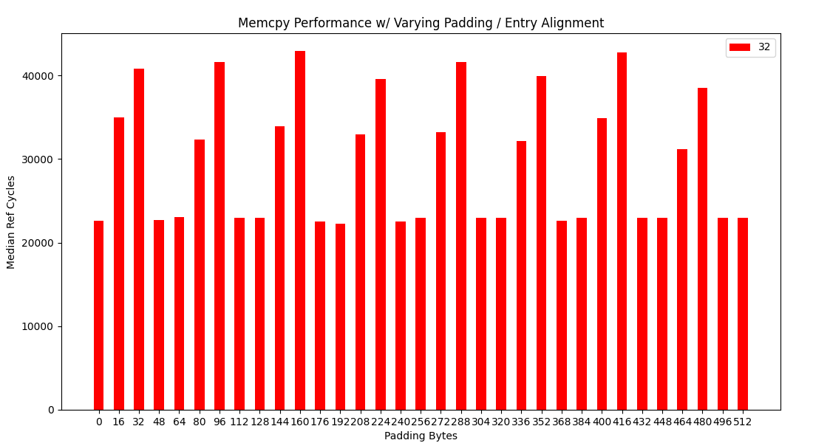
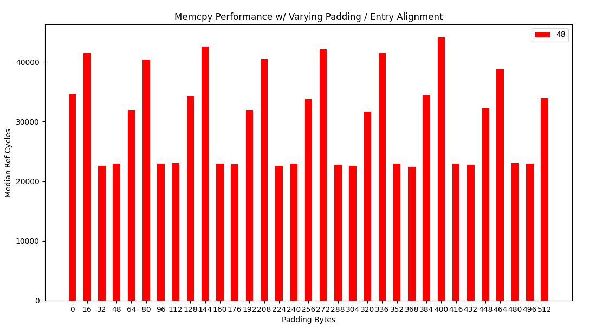
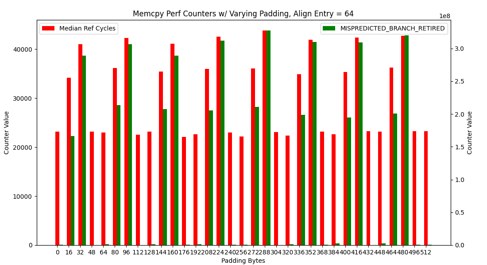

## Testing Conditions

- [**CPU**](https://ark.intel.com/content/www/us/en/ark/products/208921/intel-core-i7-1165g7-processor-12m-cache-up-to-4-70-ghz-with-ipu.html)
- Results are from [`run_rand_bench`](https://github.com/goldsteinn/glibc-memcpy/blob/main/src/bench/bench-memcpy.h#L27). Each trials (**100,000**) runs **4096** iterations the  `al_src`, `al_dst`, and `sz` parameters. These values are taken from the [SPEC2017 distribution](https://github.com/goldsteinn/glibc-memcpy/blob/main/src/bench/bench-confs.c#L31). For purpose of simplifying these results `sz` is only of values in range `[0, 32]`.
- The [memcpy implementation I tested](https://github.com/goldsteinn/glibc-memcpy/blob/main/src/impl/core/memcpy-dev-v7.S) only supported `sz` in `[0, 32]` in an attempt to isolate what I believe to be the problem.
- The results are from **throughput** tests. **NOT latency**.
- All of the benchmark code is on its own page and only uses address range % 4096 in `[0, 2047]`
- The memcpy code is on its own page and only uses address range % 4096 in `[2048, 4095]`.

#### Notes on Testing Conditions
- **The testing conditions described above are the only ones I have run the entire benchmark for** (roughly 16 hours). I have tinkered with some other conditions that I though may have had an effect or be skewing the results entirely and **Did NOT see any conditions which appeared to alter the trends described below**.
- The benchmark loop calling memcpy is aligned to 64 bytes. I have not run the full benchmark on other loop alignments but have somewhat tested that other alignments / addition `nop` padding values do not change the trend in the results (although can have some effect on the exact values by what seems to be a constant factor).
- Splitting the address space on different boundaries, for example benchmark code in `[0, 511]` and memcpy in `[512, 4095]` (or `[0, 1023]` and `[1024, 4095]`) also yielded the same trend with minimal (if any) effect on the results.
- Measuring latency as opposed to throughput significantly shrunk the variance between the "fast" and "slow" mode, although the same trend in overall performance and performance counter values was still visible.

#### Notes on Tested Parameters / Implementation
The **parameters** tested are as follows:
- **`ALIGN_ENTRY`** in `[0, 16, 32, 48]`. 
    - The formula for computing the entry address % 4096 of `memcpy` is `2048 + (ALIGN_ENTRY % 64)`.
- **`PADDING`** in `[0...1025]` s.t `padding % 16` in `[0, 1]`

The **implementation** with the above parameters is as follows:

```
 // + ALIGN_ENTRY % 64
 
memcpy: 

 // Note: at address of memcpy % 16 == 0 there is a branch
 
 800:	48 83 fa 20          	cmp    $0x20,%rdx
 804:	72 2a                	jb     830 <memcpy_dev_v32_movsb+0x30>
 806:	62 e1 fe 28 6f 06    	vmovdqu64 (%rsi),%ymm16
 80c:	62 61 fe 28 6f 7c 16 	vmovdqu64 -0x20(%rsi,%rdx,1),%ymm31
 813:	ff 
 814:	62 e1 fe 28 7f 07    	vmovdqu64 %ymm16,(%rdi)
 81a:	62 61 fe 28 7f 7c 17 	vmovdqu64 %ymm31,-0x20(%rdi,%rdx,1)
 821:	ff 
 822:	c3                   	retq   
 823:	66 66 2e 0f 1f 84 00 	data16 nopw %cs:0x0(%rax,%rax,1)
 82a:	00 00 00 00 
 82e:	66 90                	xchg   %ax,%ax
 
 // + PADDING
 
L(less_vec): 
 830:	83 fa 10             	cmp    $0x10,%edx
 833:	73 2b                	jae    860 <memcpy_dev_v32_movsb+0x60>
 835:	83 fa 08             	cmp    $0x8,%edx
 838:	73 46                	jae    880 <memcpy_dev_v32_movsb+0x80>
 83a:	83 fa 04             	cmp    $0x4,%edx
 83d:	73 61                	jae    8a0 <memcpy_dev_v32_movsb+0xa0>
 83f:	83 fa 01             	cmp    $0x1,%edx
 842:	72 11                	jb     855 <memcpy_dev_v32_movsb+0x55>
 844:	0f b6 4c 16 ff       	movzbl -0x1(%rsi,%rdx,1),%ecx
 849:	74 06                	je     851 <memcpy_dev_v32_movsb+0x51>
 84b:	0f b7 36             	movzwl (%rsi),%esi
 84e:	66 89 37             	mov    %si,(%rdi)
 851:	88 4c 17 ff          	mov    %cl,-0x1(%rdi,%rdx,1)
 855:	c3                   	retq   
 856:	66 2e 0f 1f 84 00 00 	nopw   %cs:0x0(%rax,%rax,1)
 85d:	00 00 00 
 860:	c5 fa 6f 06          	vmovdqu (%rsi),%xmm0
 864:	c5 fa 6f 4c 16 f0    	vmovdqu -0x10(%rsi,%rdx,1),%xmm1
 86a:	c5 fa 7f 07          	vmovdqu %xmm0,(%rdi)
 86e:	c5 fa 7f 4c 17 f0    	vmovdqu %xmm1,-0x10(%rdi,%rdx,1)
 874:	c3                   	retq   
 875:	66 66 2e 0f 1f 84 00 	data16 nopw %cs:0x0(%rax,%rax,1)
 87c:	00 00 00 00 
 880:	48 8b 0e             	mov    (%rsi),%rcx
 883:	48 8b 74 16 f8       	mov    -0x8(%rsi,%rdx,1),%rsi
 888:	48 89 0f             	mov    %rcx,(%rdi)
 88b:	48 89 74 17 f8       	mov    %rsi,-0x8(%rdi,%rdx,1)
 890:	c3                   	retq   
 891:	66 66 2e 0f 1f 84 00 	data16 nopw %cs:0x0(%rax,%rax,1)
 898:	00 00 00 00 
 89c:	0f 1f 40 00          	nopl   0x0(%rax)
 8a0:	8b 0e                	mov    (%rsi),%ecx
 8a2:	8b 74 16 fc          	mov    -0x4(%rsi,%rdx,1),%esi
 8a6:	89 0f                	mov    %ecx,(%rdi)
 8a8:	89 74 17 fc          	mov    %esi,-0x4(%rdi,%rdx,1)
 8ac:	c3                   	retq
```

##### Please Note
- **The exact address, and address % 64 of `L(less_vec)` changes with `ALIGN_ENTRY`.**
- **`PADDING` essentially represents `address_of(memcpy) - address_of(L(less_vec)) + 48`**


## Results

The results for `Ref Cycles` (from `rdtsc`) vs `PADDING` for `ALIGN_ENTRY` in `[0, 16, 32, 48]` are:

Note: `ALIGN_ENTRY` of `64` == `ALIGN_ENTRY` of `0` because of the % 64.










The results seems to depend on `ALIGN_ENTRY` and `PADDING % 64`. The following table sumarizes the basic results:

|ALIGN_ENTRY|0       |16      |32      |48      |
|-----------|--------|--------|--------|--------|
|0          |FAST    |SLOWER  |SLOWEST |FAST    |
|16         |SLOWER  |SLOWEST |FAST    |FAST    |
|32         |FAST    |SLOWER  |SLOWEST |FAST    |
|48         |SLOWER  |SLOWEST |FAST    |FAST    |


The above table adjust for `ALIGN_ENTRY` and `address_of(L(less_vec)) % 64` are as follows:

|ALIGN_ENTRY|0       |16      |32      |48      |
|-----------|--------|--------|--------|--------|
|0          |SLOWER  |SLOWEST |FAST    |FAST    |
|16         |SLOWER  |SLOWEST |FAST    |FAST    |
|32         |FAST    |FAST    |SLOWER  |SLOWEST |
|48         |FAST    |FAST    |SLOWER  |SLOWEST |


Which appears to show that if `32 & (address_of(L(less_vec)) - address_of(memcpy))` (aka the begining of `memcpy` and begining of `L(less_vec)` are on different halves of a cache line) the implementation will run "Fast", otherwise it will run "Slow".

## Cause(s)?

1. **Branch Misses**
2. **Uop Cache**
4. **Other?**




Note: This figure (and all ensuing figures) will use `--alignments 64` as the same pattern is clear for 16, 32, and 48. 


#### Potential Reasons for More Branch Misses

**Note: I don't know. This is speculation of mechanisms I don't understand.**

In the two "Slow" modes we see roughly 10^8 total branch misses. This corresponds with total calls to `memcpy` (`4096 * 100,000 ~= 10^3 * 10^5 ~= 10^8`). So it appears that in the "Slow" modes we get roughly one extra branch miss per call. More precisely "Slower" mode has roughly `[.4, .55]` branch misses per call and "Slowest" mode has roughly `[.7, .75]` branch misses per call.


**LSD.UOPS** event is 0 so this is not caused by transitions to and from and LSD.


- **BPU Thrashing**: A plausible(ish) sounding explination is that the address of the first branch instruction (its `ip`) at the entry of `memcpy` and the branch instructions in `L(less_vec)` conflicting with eachother position in the `BPU`.
    - This only holds weight if the BPU only indexes the lower 6 bits (`ip % 64`) as we see transitions from "Slow" to "Fast" based on `ip % 64` being in the same vs different 32 byte regions respectively.
    - AFAICT this does not explain the "Slower" vs "Slowest" differential.
    - We see a roughly equal increase in `BR_MISP_RETIRED_COND_NTAKEN` vs `BR_MISP_RETIRED_COND_TAKEN` (see figure below). Since of the branches are "forward" static prediction should have them as not taken which would 

Some **dynamic prediction** would have to be causing this. The only two dynamic branch prediction entities I'm aware of are the **BHT** and **BPU**. 

I think we can rule out of 
- **BHT Thrashing**
    - 


