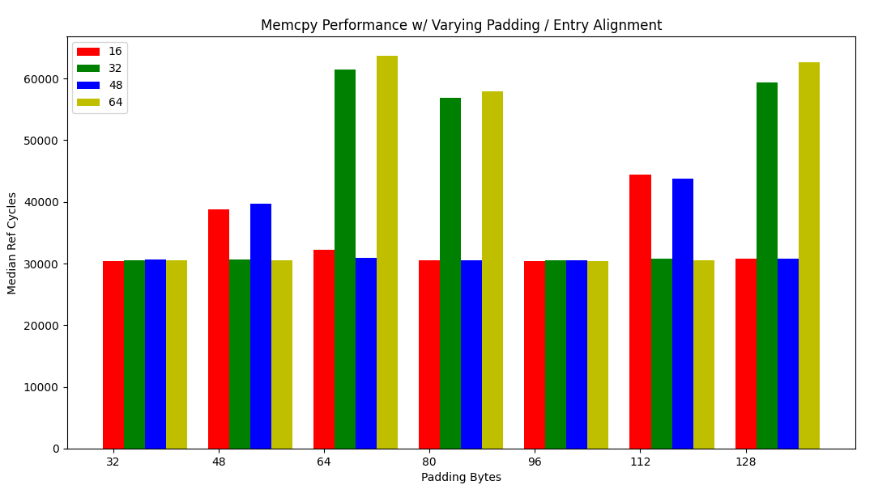

## Testing Conditions

- [**CPU**](https://ark.intel.com/content/www/us/en/ark/products/208921/intel-core-i7-1165g7-processor-12m-cache-up-to-4-70-ghz-with-ipu.html)
- Results are from [`run_rand_bench`](https://github.com/goldsteinn/glibc-memcpy/blob/main/src/bench/bench-memcpy.h#L27). Each trials (**100,000**) runs **4096** iterations the  `al_src`, `al_dst`, and `sz` parameters. These values are taken from the [SPEC2017 distribution](https://github.com/goldsteinn/glibc-memcpy/blob/main/src/bench/bench-confs.c#L31).
- I tested two memcpy implementations. [The first implementation](https://github.com/goldsteinn/glibc-memcpy/blob/main/src/impl/core/memcpy-dev-v7.S) only supported `sz` in `[0, 32]` (and thus only used sizes in that range from the SPEC distribution) in an attempt to isolate what I believe to be the problem. [The second implementation](https://github.com/goldsteinn/glibc-memcpy/blob/main/src/impl/core/memcpy-dev-v4.S#L22) is essentially GLIBC's.
- The results are from **throughput** tests. **NOT latency**.
- All of the benchmark code is on its own page and only uses address range % 4096 in `[0, 2047]`
- The memcpy code is on its own page and only uses address range % 4096 in `[2048, 4095]`.

#### Notes on Testing Conditions
- **The testing conditions described above are the only ones I have run the entire benchmark for**. I have tinkered with some other conditions that I though may have had an effect or be skewing the results entirely and **Did NOT see any conditions which appeared to alter the trends described below**.
- The benchmark loop calling memcpy is aligned to 64 bytes. I have not run the full benchmark on other loop alignments but have somewhat tested that other alignments / addition `nop` padding values do not change the trend in the results (although can have some effect on the exact values by what seems to be a constant factor).
- Splitting the address space on different boundaries, for example benchmark code in `[0, 511]` and memcpy in `[512, 4095]` (or `[0, 1023]` and `[1024, 4095]`) also yielded the same trend with minimal (if any) effect on the results.
- Measuring latency as opposed to throughput significantly shrunk the variance between the "fast" and "slow" mode, although the same trend in overall performance and performance counter values was still visible.

#### Notes on Tested Parameters / Implementation
The **parameters** tested are as follows:
- **`ALIGN_ENTRY`** in `[0, 16, 32, 48]`. 
    - The formula for computing the entry address % 4096 of `memcpy` is `2048 + (ALIGN_ENTRY % 64)`.
- **`PADDING`** in `[0...1025]` s.t `padding % 16` in `[0, 1]`

The `sz` in `[0, 32]` **implementation** with the above parameters is as follows:

```
 // + ALIGN_ENTRY % 64
 
memcpy: 

 // Note: at address of memcpy % 16 == 0 there is a branch for if (sz < 32) goto L(less_vec)
 
 800:	48 83 fa 20          	cmp    $0x20,%rdx
 804:	72 2a                	jb     830 <memcpy_dev_v32_movsb+0x30>
 806:	62 e1 fe 28 6f 06    	vmovdqu64 (%rsi),%ymm16
 80c:	62 61 fe 28 6f 7c 16 	vmovdqu64 -0x20(%rsi,%rdx,1),%ymm31
 813:	ff 
 814:	62 e1 fe 28 7f 07    	vmovdqu64 %ymm16,(%rdi)
 81a:	62 61 fe 28 7f 7c 17 	vmovdqu64 %ymm31,-0x20(%rdi,%rdx,1)
 821:	ff 
 822:	c3                   	retq   
 823:	66 66 2e 0f 1f 84 00 	data16 nopw %cs:0x0(%rax,%rax,1)
 82a:	00 00 00 00 
 82e:	66 90                	xchg   %ax,%ax
 
 // + PADDING
 
L(less_vec): 
 830:	83 fa 10             	cmp    $0x10,%edx
 833:	73 2b                	jae    860 <memcpy_dev_v32_movsb+0x60>
 ...
```

And the full implementation is as follows:

```
 // Note: at address of memcpy % 16 == 0 there is a branch for if (sz < 32) goto L(less_vec)
 800:	48 89 f8             	mov    %rdi,%rax
 803:	48 83 fa 20          	cmp    $0x20,%rdx
 
 // Note only including padding >= 32 as otherwise the 6 vs 2 byte encoding changes the alignment of L(less_vec)
 
 807:	0f 82 93 00 00 00    	jb     8a0 <memcpy_dev_v32_movsb+0xa0>
 80d:	48 83 fa 40          	cmp    $0x40,%rdx
 811:	0f 87 f1 00 00 00    	ja     908 <memcpy_dev_v32_movsb+0x108>
 817:	62 e1 fe 28 6f 06    	vmovdqu64 (%rsi),%ymm16
 81d:	62 e1 fe 28 6f 4c 16 	vmovdqu64 -0x20(%rsi,%rdx,1),%ymm17
 824:	ff 
 825:	62 e1 fe 28 7f 07    	vmovdqu64 %ymm16,(%rdi)
 82b:	62 e1 fe 28 7f 4c 17 	vmovdqu64 %ymm17,-0x20(%rdi,%rdx,1)
 832:	ff 
 833:	c3                   	retq   
 
 // MOVSB
 
 834:	48 3b 15 00 00 00 00 	cmp    0x0(%rip),%rdx        # 83b <memcpy_dev_v32_movsb+0x3b>
 83b:	0f 83 9c 01 00 00    	jae    9dd <memcpy_dev_v32_movsb+0x1dd>
 841:	48 39 f7             	cmp    %rsi,%rdi
 844:	72 17                	jb     85d <memcpy_dev_v32_movsb+0x5d>
 846:	74 29                	je     871 <memcpy_dev_v32_movsb+0x71>
 848:	4c 8d 0c 16          	lea    (%rsi,%rdx,1),%r9
 84c:	4c 39 cf             	cmp    %r9,%rdi
 84f:	0f 82 58 02 00 00    	jb     aad <memcpy_dev_v32_movsb+0x2ad>
 855:	48 89 f9             	mov    %rdi,%rcx
 858:	48 29 f1             	sub    %rsi,%rcx
 85b:	eb 06                	jmp    863 <memcpy_dev_v32_movsb+0x63>
 85d:	48 89 f1             	mov    %rsi,%rcx
 860:	48 29 f9             	sub    %rdi,%rcx
 863:	83 f9 3f             	cmp    $0x3f,%ecx
 866:	0f 86 a9 00 00 00    	jbe    915 <memcpy_dev_v32_movsb+0x115>
 86c:	48 89 d1             	mov    %rdx,%rcx
 86f:	f3 a4                	rep movsb %ds:(%rsi),%es:(%rdi)
 871:	c3                   	retq   

 
 // + PADDING (Minimum == 32)
 
L(less_vec):
 880:	80 fa 10             	cmp    $0x10,%dl
```

##### Please Note
- **The exact address, and address % 64 of `L(less_vec)` changes with `ALIGN_ENTRY`.**
- **`PADDING` essentially represents `address_of(memcpy) - address_of(L(less_vec)) + N`** with `N = 48` for the `sz` in `[0, 32]` implementation `N = 128` for the full implementation.


## Results

The results for `Ref Cycles` (from `rdtsc`) vs `PADDING` for `ALIGN_ENTRY` in `[0, 16, 32, 48]` are:

Note: `ALIGN_ENTRY` of `64` == `ALIGN_ENTRY` of `0` because of the % 64.

**Results for `sz` in `[0, 32]` implementation:**


The results seems to depend on `ALIGN_ENTRY` and `PADDING % 64`. The following table sumarizes the basic results:

|ALIGN_ENTRY|0       |16      |32      |48      |
|-----------|--------|--------|--------|--------|
|0          |FAST    |SLOWER  |SLOWEST |FAST    |
|16         |SLOWER  |SLOWEST |FAST    |FAST    |
|32         |FAST    |SLOWER  |SLOWEST |FAST    |
|48         |SLOWER  |SLOWEST |FAST    |FAST    |


The above table adjust for `ALIGN_ENTRY` and `address_of(L(less_vec)) % 64` are as follows:

|ALIGN_ENTRY|0       |16      |32      |48      |
|-----------|--------|--------|--------|--------|
|0          |SLOWER  |SLOWEST |FAST    |FAST    |
|16         |SLOWER  |SLOWEST |FAST    |FAST    |
|32         |FAST    |FAST    |SLOWER  |SLOWEST |
|48         |FAST    |FAST    |SLOWER  |SLOWEST |


Which appears to show that if `32 & (address_of(L(less_vec)) - address_of(memcpy))` (aka the begining of `memcpy` and begining of `L(less_vec)` are on different halves of a cache line) the implementation will run "Fast", otherwise it will run "Slow".

**Results for full implementation:**



The results again seem to depend on `ALIGN_ENTRY` and `PADDING % 64`. The following table sumarizes the basic results:

|ALIGN_ENTRY|0       |16      |32      |48      |
|-----------|--------|--------|--------|--------|
|0          |SLOWEST |SLOWER  |FAST    |FAST    |
|16         |FAST    |FAST    |FAST    |SLOWER  |
|32         |SLOWEST |SLOWER  |FAST    |FAST    |
|48         |FAST    |FAST    |FAST    |SLOWER  |


The above table adjust for `ALIGN_ENTRY` and `address_of(L(less_vec)) % 64` are as follows:

|ALIGN_ENTRY|0       |16      |32      |48      |
|-----------|--------|--------|--------|--------|
|0          |SLOWEST |SLOWER  |FAST    |FAST    |
|16         |SLOWER  |FAST    |FAST    |FAST    |
|32         |FAST    |FAST    |SLOWEST |SLOWER  |
|48         |FAST    |FAST    |SLOWER  |FAST    |

The results for the two implementations follow roughly the same pattern, especially for `ALIGN_ENTRY` and `address_of(L(less_vec)) % 64`. 

Though why `ALIGN_ENTRY` as 16/48 appears to be faster for the full implementation is unanswered.


One **interesting observation** is that both the full and `sz` in `[0, 32]` implementations appear to benefit greater from the same `32 & (address_of(L(less_vec)) - address_of(memcpy))` formula. The reason for which I am unsure, the rest of this writeup will focus on possible explinations and questions that I believe need to be answered.


## Cause(s)?

1. **Branch Misses**
2. **Uop Cache**
4. **Other?**

#### Branch Misses

Looking first at the `sz` in `[0, 32]` implementation:


Note: This figure (and all ensuing figures) will use `--alignments 64` as the same pattern is clear for 16, 32, and 48. 

We see `MISPREDICTED_BRANCH_RETIRED` mirror the performance trend almost exactly.

|Mode       |Misses Per Iteration|
|-----------|--------------------|
|FAST       | 10^-4              |
|SLOWER     |~.5                 |
|SLOWEST    |~.8                 |


In the full implementation we still do see a spike in branch misses in the "Slow" modes and roughly the same trend in misses per iteration.

An interesting point, however, is that for `ALIGN_ENTRY = 16,48` for the full mode, which don't have a clear "Slow" mode like `ALIGN_ENTRY = 32,64` (or any `ALIGN_ENTRY` for the `sz` in `[0, 32]` implementation) we don't see any spike in branch misses.


The two possibilities for where something could be going wrong in the **BPU** are the **BHT** and **BTB**. Frankly I don't know enough about the internals of each of these components to make any meaningful hypothesis. 

But I do have some questions that maybe you can help answer which will help debug this:

1. The branch misses would be a culprit and could not be caused by some other mechanism?
    - When playing around with the *Latency* benchmarks I notice the same trend in performance regarding alignments and roughly the same trend in branch misses. Despite this, the total variance between "Slow" and "Fast" mode is significantly smaller. To me this supports the case that branch misses are the culprit as it would predict that when measuring latency the cost of a branch miss would be reduced due to a shorter active pipeline.
    
2. On a **BTB** miss and **BHT** hit, we should expect to not see any discrepency in uops issued vs uops retired because the cpu will resteer before execution. Correct? Or does the **BTB** miss still cause some kind of destructive rollback that causes unrelated uops to be replayed?
    - If this is the case then the above scenario does not seem plausible as we do see in increase in uops issued vs retired in the "Slow" mode.
    - I am interested in this because the data above regarding "Fast" / "Slow" mode suggests that "Fast" mode occurs when `32 & (address_of(L(less_vec)) - address_of(memcpy))` and otherwise we see "Slow" mode. This pattern repeats itself on a 64 byte frequency. The only mechanism in the **BPU** I know of that operates on 32 byte blocks in the **BTB**. And AFAIK the **BTB** hardware is more scarce than the **BHT** hardware so it seems more plausible that such a small intereference pattern as 64 bytes would be present.
    
3. Given that the **BHT** has many more than 64 entries (2048 IIRC) it should not be possible for some **thrashing** to occur in the **BHT**. Correct? If that is the case is there any part of the **BPU** other than the **BTB** that could be causing this?


#### Uop Cache

There are no performance counters which appear to indicate an issue with the uop cache or frontend in general (disregarding the resteers due to branch misses) but performance issues due to 32 byte `ip` aliasing generally point to it, so I thought I'd include some investigation.


As you can see, while we do see a spike in `DSB_UOPS`, it seems to track exactly with total `UOPS_ISSUED_ANY` which to me means this is totally unrelated to anything going on in the FE and related to just reissuing due to branch misses.

Likewise we don't see anything obvious with `MS` or `MITE` decoders


Ultimately I want to believe this has something to do with the Uop Cache because that is a much more approachable subject in terms of information available than the **BPU**, but I don't see any evidence for it.

#### Other?

You tell me.


## Thoughts

1. I am still unsure if the performance changes are exclusive to the benchmark, or if they would apply in other cirumstances. Since I was able to reproduce similiar results with measuring latency, `sz` in `[0, 32]`, and full SPEC distribution I am inclined to believe there is something actually going on. But I am still uncertain.
    - Evidence that it is the benchmark is that in the "Fast" mode we see next to 0 branch misses. This does not seem expected for a random distribution.
    - Otherwise my feeling there is some internal **thrashing** somewhere in the **BPU**. If this is the case I think it is a true issue with the implementation.

2. At this time I think I have enough information to write a memcpy which will perform better on the benchmark, though without understand the root cause (or even point 1.) I still think ALOT more investigation is needed. While I have tentatively confirmed these results on Skylake, without understanding root cause I think its more likely we end up with an implementation that performs well on my computers than one that is actually better.


